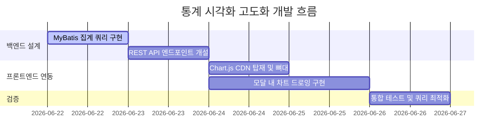

# 📋 대시보드 통계 시각화 고도화 (Analytics UI Visual) 구현 계획서

본 문서는 사용자가 생성한 단축 링크의 접속 통계 데이터(접속 기기, OS, 일자별 클릭 수, 광고 및 페이월 전환)를 보다 직관적으로 파악할 수 있도록, 기존 텍스트 형태의 로그 리스트를 **Chart.js 기반의 세련된 모던 그래프 UI**로 고도화하기 위한 상세 개발 및 통합 계획서입니다.

---

## 1. 개요 및 요구사항 정의

### 1.1. 현 상태 분석
* 현재 단축 링크별 상세 통계는 모달창 내에 접속 IP 해시, OS, 기기 유형, 리퍼러, 시간 등이 **단순 텍스트 테이블 리스트** 형태로만 출력되고 있어 데이터 트렌드(성능 추이, 모바일 점유율 등)를 한눈에 식별하기 어렵습니다.

### 1.2. 고도화 목표
* **사용성 향상 (WOW UX)**: 텍스트 수치를 직관적인 차트(선 그래프, 도넛 차트)로 렌더링하여 마케터들이 마케팅 성과를 1초 만에 분석할 수 있도록 돕습니다.
* **차트 라이브러리 선정**: 프로젝트 프레임워크가 Thymeleaf + Vanilla JS 환경이므로, 별도의 빌드 단계가 필요 없고 Canvas 기반으로 렌더링 성능이 뛰어난 **Chart.js (v4.x)**를 연동합니다.
* **미려한 디자인 시스템 반영**: Plain 색상을 배제하고 시스템 테마인 로열 블루(`--accent-primary`), 인디고 퍼플 (`--accent-secondary`), 소프트 블루 (`--accent-light`) 계열의 그라데이션 및 세련된 모노톤 팔레트를 적용합니다.

---

## 2. 시각화 대상 통계 데이터 설계

단축 링크 방문 시 수집되는 `click_logs` 테이블의 원천 데이터를 기반으로 다음 4가지 핵심 차트를 제공합니다.

| 차트 종류 | 시각화 형태 (Type) | 집계 대상 (Metrics) | 설명 |
| :--- | :--- | :--- | :--- |
| **일별 클릭수 추이** | Line Chart (선 그래프) | `timestamp` 기준 일별 클릭 횟수 | 최근 7일 혹은 30일간 유입 트렌드 분석 (그라데이션 채우기 반영) |
| **접속 기기 점유율** | Donut Chart (도넛) | `device_type` 분포 (Desktop, Mobile, Tablet) | 접속 디바이스 비중 확인 |
| **운영체제(OS) 점유율** | Donut Chart (도넛) | `os_type` 분포 (Windows, Android, iOS, macOS 등) | 모바일 vs PC 운영체제 비중 분석 |
| **광고/페이월 성과 분석** | Multi-Bar Chart (막대) | `is_ad_clicked`, `is_converted` 카운트 | 광고 클릭 수 및 실제 상품/페이월 결제 전환율 비교 분석 |

---

## 3. 아키텍처 및 상세 구현 계획

### 3.1. 백엔드 집계 API 설계
백엔드에서 상세 통계 데이터를 가공하여 JSON 형태로 프론트엔드에 전달할 수 있도록 REST API 엔드포인트를 신설합니다.

* **API URL**: `GET /api/links/{linkId}/analytics`
* **응답 JSON 스키마 예시**:
```json
{
  "linkId": "short-code-uuid",
  "dailyClicks": [
    {"date": "2026-06-16", "clicks": 45, "adClicks": 12, "conversions": 3},
    {"date": "2026-06-17", "clicks": 58, "adClicks": 20, "conversions": 5},
    {"date": "2026-06-18", "clicks": 72, "adClicks": 25, "conversions": 8}
  ],
  "devices": [
    {"name": "Mobile", "value": 120},
    {"name": "Desktop", "value": 55},
    {"name": "Tablet", "value": 15}
  ],
  "operatingSystems": [
    {"name": "iOS", "value": 85},
    {"name": "Android", "value": 35},
    {"name": "Windows", "value": 45},
    {"name": "macOS", "value": 10}
  ]
}
```

* **MyBatis 쿼리 가공**:
  - `click_logs` 테이블의 `timestamp` 문자열을 날짜 포맷(`YYYY-MM-DD`)으로 그룹화하여 일별 집계를 수행합니다. (SQLite는 `strftime('%Y-%m-%d', timestamp)` 사용, PostgreSQL은 `to_char(timestamp, 'YYYY-MM-DD')` 혹은 `date(timestamp)` 호환 처리 분기 필요)

### 3.2. 프론트엔드 차트 렌더링 구현
* **Chart.js CDN 연동**:
  - `fragments.html` 혹은 대시보드 헤더 템플릿에 차트 라이브러리 로드 스크립트 추가:
    `<script src="https://cdn.jsdelivr.net/npm/chart.js"></script>`
* **대시보드 통계 모달 개편**:
  - 기존의 텍스트 스크롤 영역 상단에 **2단 그리드 차트 컨테이너**를 추가합니다.
    - 좌측: 일별 누적 클릭 및 전환율 추이 (Line 차트)
    - 우측: 디바이스/OS 점유율 (도넛 차트 탭 전환 구조 제공)
  - 차트의 애니메이션 옵션(`animation: { duration: 800 }`)을 활용해 모달 오픈 시 차트가 스무스하게 차오르는 인터랙션을 제공합니다.

---

## 4. 디자인 및 스타일 가이드

모던하고 고급스러운 웹 앱 아이덴티티 유지를 위해 다음 테마 값을 차트 데이터셋 색상으로 맵핑합니다.

```javascript
// 차트 색상 팔레트 예시
const themeColors = {
  royalBlue: 'rgba(29, 78, 216, 0.85)',       // 주조색 (#1D4ED8)
  indigoPurple: 'rgba(79, 70, 229, 0.85)',    // 보조색 (#4F46E5)
  softSkyBlue: 'rgba(14, 165, 233, 0.85)',     // 기기용 3순위 (#0EA5E9)
  gradientStart: 'rgba(29, 78, 216, 0.3)',    // 라인 그라데이션 채우기 시작
  gradientEnd: 'rgba(29, 78, 216, 0.0)'       // 라인 그라데이션 채우기 끝
};
```

---

## 5. 검증 및 테스트 계획 (Verification)

### 5.1. 시나리오 기반 통합 검증
1. **통계 API 정합성**:
   - `sqlite3` DB에 테스트 클릭 로그 데이터를 50개 이상 기기별/OS별/일자별로 적재하고, `/api/links/{id}/analytics` API 호출 시 JSON 데이터가 누락 없이 올바르게 그룹화 집계되는지 검증.
2. **반응형 렌더링 무결성**:
   - Canvas 객체가 모바일 화면(360px)부터 데스크톱 화면(1200px)까지 깨짐 없이 유동적으로 조절(`responsive: true, maintainAspectRatio: false`)되는지 체크.
3. **크로스 데이터베이스 호환성**:
   - 일자 그룹화 SQL 쿼리가 로컬 SQLite 및 운영 환경 PostgreSQL 서비스 모두에서 에러 없이 실행되는지 이중 검증.

---

## 6. 개발 로드맵


