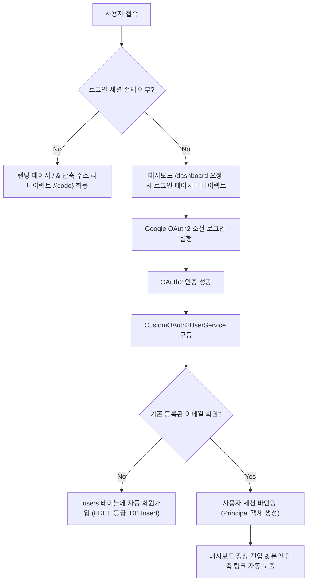

# 18단계: Spring Security & OAuth2 소셜 로그인 통합 연동 구현 계획서

본 계획서는 기존의 모의 계정(Query Parameter `userId=test-user` 등)에 의존하던 취약한 인증 구조를 탈피하고, 실제 상용 서비스(Production) 배포가 가능하도록 **Spring Security 기반의 보안 연결 및 OAuth2 소셜 로그인(Google OAuth2 등) 연동**을 구현하기 위한 설계 계획서입니다.

---

## 🛠️ 주요 변경 사양 및 설계안

### 1. 보안 프레임워크 도입 (Spring Security & OAuth2 Client)
- `build.gradle`에 `spring-boot-starter-security` 및 `spring-boot-starter-oauth2-client` 의존성을 탑재합니다.
- Thymeleaf와 Spring Security의 연동을 위해 `thymeleaf-extras-springsecurity6`를 도입하여 로그인 유저 상태에 따른 UI 분기 처리를 지원합니다.

### 2. 세션 기반 인증 및 OAuth2 흐름 구성
- SSR(Server-Side Rendering) 프로젝트이므로 복잡한 JWT 대신 표준적이고 검증된 **HTTP Session 및 Cookie 기반의 인증 관리**를 수행합니다.
- `SecurityFilterChain` 설정을 통해 아래 경로들을 인가 제외(`permitAll()`) 합니다:
  - 랜딩 페이지 및 정적 리소스 (`/`, `/css/**`, `/js/**`, `/images/**`)
  - 비회원 단축 링크 발급 API (`/api/links?userId=anonymous` 등)
  - 단축 주소 리다이렉트 및 광고/페이월 뷰 (`/{shortCode}`, `/monetization/**`, `/api/links/*/ad-click`, `/api/links/*/payments/confirm` 등)
- 이외의 대시보드 관련 경로(`/dashboard/**`, `/api/dashboard/**`)는 인증된 유저만 접근 가능하도록(`authenticated()`) 제어합니다.

### 3. 신규 가입 자동 연동 (Custom OAuth2 User Service)
- OAuth2 인증이 완료되면 `CustomOAuth2UserService`가 공급자(Google 등)로부터 이메일 및 고유 식별자(ID)를 수집합니다.
- 데이터베이스 `users` 테이블에서 조회하여 존재하지 않는 신규 유저일 경우, 해당 식별자를 PK(`id`)로 삼아 기본 **FREE** 등급의 유저 정보를 자동으로 데이터베이스에 영속 적재(INSERT)합니다.
- 로그인 완료 후, 기존 컨트롤러들이 쿼리 파라미터 대신 Security Context의 `Authentication` 혹은 `@AuthenticationPrincipal` 객체로부터 로그인된 사용자 정보를 획득하도록 컨트롤러 코드를 전면 리팩토링합니다.

---

## User Review Required

> [!IMPORTANT]
> **구글 소셜 로그인 Client ID / Client Secret 속성 기재**
> - 로컬 개발 및 빌드 과정에서 구글 클라이언트 ID 인증 오류가 발생하지 않도록, `application.properties`에 기본 Mock 자격증명 속성을 주입해 둡니다.
> - 실제 서비스 운영 시에는 사용자가 환경 변수(예: `SPRING_SECURITY_OAUTH2_CLIENT_REGISTRATION_GOOGLE_CLIENT_ID`) 형태로 주입하여 오버라이딩하여 사용할 수 있도록 구조화합니다.

> [!WARNING]
> **기존 Mock User와의 호환성 유지**
> - 기존 통합 테스트 스펙 및 화면에서의 Mock User 계정(`test-user`, `admin`, `free-user`) 연동과의 충돌을 방지하기 위해, 로컬 개발 프로파일(`local` 또는 `dev`) 구동 시에 한하여 특정 테스트 인증 헬퍼나 스프링 시큐리티 예외 처리를 일부 허용하여 기존 테스트의 무결성을 깨뜨리지 않는 유연한 구조를 지향합니다.

---

## Proposed Changes

### [Dependencies & Configurations]
#### [MODIFY] [build.gradle](file:///h:/lee/pixel-link/build.gradle)
- `spring-boot-starter-security`, `spring-boot-starter-oauth2-client`, `thymeleaf-extras-springsecurity6` 추가.

#### [MODIFY] [application.properties](file:///h:/lee/pixel-link/src/main/resources/application.properties)
- Google OAuth2 Client 자격증명(Client ID, Client Secret) 로컬 Mock 설정값 기재.

### [Security Core & Services]
#### [NEW] [WebSecurityConfig.java](file:///h:/lee/pixel-link/src/main/java/com/pixellink/config/WebSecurityConfig.java)
- Spring Security 인가(Authorization) 및 인증(Authentication) 체계 설정, OAuth2 로그인 성공 엔드포인트 세팅.

#### [NEW] [CustomOAuth2UserService.java](file:///h:/lee/pixel-link/src/main/java/com/pixellink/service/CustomOAuth2UserService.java)
- OAuth2 인증 유저 프로필 수집 및 DB 자동 회원가입/갱신 처리.

#### [NEW] [SessionUser.java](file:///h:/lee/pixel-link/src/main/java/com/pixellink/dto/SessionUser.java)
- 세션 객체 직렬화를 위한 DTO 클래스 신설.

### [Controllers Refactoring]
#### [MODIFY] [DashboardController.java](file:///h:/lee/pixel-link/src/main/java/com/pixellink/controller/DashboardController.java)
- `@AuthenticationPrincipal` 어노테이션을 활용하여 로그인 세션 정보로부터 `userId` 획득 후 화면 바인딩.

#### [MODIFY] [LinkApiController.java](file:///h:/lee/pixel-link/src/main/java/com/pixellink/controller/LinkApiController.java)
- API 요청 처리 시 로그인 세션에서 유효 유저 정보를 바인딩하여 쿼리 파라미터 의존도 축소.

---

## Verification Plan

### Automated Tests
- `DashboardControllerTest.java`에 시큐리티 인증 필터를 적용하여 모의 인증된 유저 세션 환경을 모킹한 뒤 컨트롤러 요청 테스트를 수행하고 전체 Gradle 빌드 패스 확인.
- `ExternalLinkApiControllerTest.java`에서 Header API key 인증과 시큐리티가 정상적으로 공존하여 API 통신을 수행하는지 단위 테스트 검증.

### Manual Verification
- 로컬 서버 구동 상태에서 로그인되지 않은 채 `/dashboard` 요청 시 Spring Security에 의해 로그인 페이지(`/login` 등)로 리다이렉트되는지 확인.
- 구글 소셜 로그인을 실행하여 인증 성공 시 신규 계정이 데이터베이스 `users` 테이블에 정상 자동 회원가입되는지 검증.
