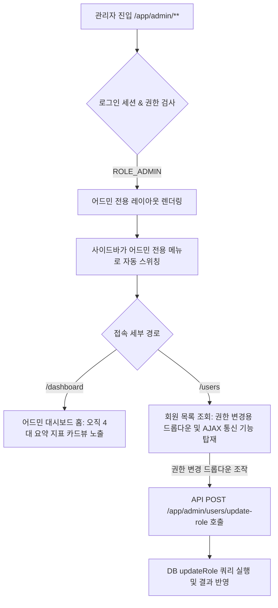

# 관리자 대시보드 구축 및 카드뷰 포털 화면 개발 계획서

본 계획서는 로그인 기능 통합 이후 시스템 관리 효율을 높이고, 향후 5개 이상의 어드민 기능 확장에 유연하게 대응하기 위해 **독립형 관리자(Admin) 사이드바 스위칭 체계를 구축하고, 오직 핵심 지표 카드뷰로만 구성된 어드민 대시보드 홈을 개발**하는 구체적인 설계안입니다. 

또한 관리자가 데이터베이스를 직접 수동 제어하는 번거로움 없이 회원 권한을 실시간으로 관리할 수 있도록 **회원 목록 화면 내 접근 권한(Role) 변경 기능**을 추가로 구현합니다.

기존 레이아웃에 묻어 있던 모든 저렴해 보이는 이모지 요소를 배제하고 프리미엄 미니멀리즘 비주얼로 고도화합니다.

---

## 🛠️ 주요 변경 사양 및 설계안

### 1. 어드민 전용 독립 사이드바 스위칭 구축 (기 구현 완료)
- `/app/admin/**` 영역에 진입하면 기존 일반 메뉴 대신 **어드민 전용 사이드바 메뉴**로 동적 전환됩니다.
- **어드민 사이드바 메뉴 목록**: 어드민 홈, 회원 현황, 정산 승인, 시스템 설정, 서비스로 돌아가기.

### 2. 카드뷰 전용 어드민 대시보드 홈 개발 (`/app/admin/dashboard`) (기 구현 완료)
- 어드민 홈 화면에는 오직 **4개의 핵심 지표 요약 카드(Card View)만 바둑판 그리드로 배치**합니다.
- 카드 클릭 시 각 상응하는 어드민 상세 경로로 리다이렉션되도록 연계합니다.

### 3. 회원 권한(Role) 실시간 수정 API 및 UI 추가 [NEW]
- **백엔드 데이터 수정**:
  - `UserMapper.java`에 `void updateRole(@Param("id") String id, @Param("role") String role);` 선언.
  - `UserMapper.xml`에 `UPDATE users SET role = #{role} WHERE id = #{id}` SQL 쿼리 추가.
  - `AdminController.java`에 `@PostMapping("/users/update-role")` 비동기 API 엔드포인트 구현.
- **프론트엔드 UI 고도화**:
  - [users.html](file:///h:/lee/pixel-link/src/main/resources/templates/admin/users.html) 테이블의 '접근 권한' 열을 고정 텍스트 배지 대신 **선택 드롭다운(`select` 박스)**으로 구현합니다.
  - 관리자가 드롭다운 선택 값을 변경하면 즉시 JavaScript `fetch` API를 이용하여 서버로 권한 변경 비동기 요청을 전달하고 화면을 갱신합니다.
  - **보안 안전장치**: 관리자가 본인 계정의 권한을 스스로 박탈하는 실수(Self-demotion)를 방지하기 위해, **현재 로그인된 유저 ID와 같은 행의 권한 드롭다운은 비활성화(`disabled`)** 처리합니다.

---

## Proposed Changes

### [Database & Model Configurations] (기 완료 사양 유지)
- **`schema-sqlite.sql`**: `role TEXT DEFAULT 'USER'` 적용 완료.
- **`User.java` / `SessionUser.java`**: `role` 멤버 변수 적용 완료.

### [Data Access Layer]
- **`src/main/java/com/pixellink/mapper/UserMapper.java`**: `void updateRole(@Param("id") String id, @Param("role") String role);` 메서드 신설.
- **`src/main/resources/mapper/UserMapper.xml`**: `updateRole` 쿼리문 추가.

### [Security Config] (기 완료 사양 유지)
- **`WebSecurityConfig.java`**: `/app/admin/**` 경로 인가 통제 및 `LocalMockUserFilter` 동적 권한 맵핑 연동 완료.

### [Controllers & Service Layer]
#### [MODIFY] [AdminController.java](file:///h:/lee/pixel-link/src/main/java/com/pixellink/controller/AdminController.java)
- `@PostMapping("/users/update-role")` 비동기 API 추가: 권한 값을 받아 `userMapper.updateRole()`을 실행하고 JSON 상태 메세지 응답 반환.

### [View Templates & Assets]
#### [MODIFY] [users.html](file:///h:/lee/pixel-link/src/main/resources/templates/admin/users.html)
- 회원 목록 테이블 내 '접근 권한' 셀을 `<select>` 드롭다운 박스로 수정.
- 권한 변경 감지 시 서버에 비동기 POST 전송을 수행하고 처리 결과를 알려주는 AJAX 스크립트 추가.
- 본인 로그인 계정에 대해 드롭다운 비활성화(`th:disabled="${u.id == user.id}"`) 로직 탑재.

---

## Verification Plan

### Automated Tests
- `AdminControllerTest.java`에 `updateRole_AsAdmin_Success` 및 `updateRole_AsRegularUser_Forbidden` 통합 테스트를 작성하여, 관리자만 타인의 권한을 바꿀 수 있고 일반 사용자는 해당 API가 원천 차단(403 Forbidden)되는지 검증.

### Manual Verification
1. 관리자 권한(`userId=admin`)으로 접속 후 회원 목록 페이지로 이동합니다.
2. 일반 사용자 행(`test-user` 등)의 권한 드롭다운을 `USER`에서 `ADMIN`으로 전환한 뒤, 데이터베이스에 실제 권한이 변경되었는지 새로고침하여 확인합니다.
3. 관리자 본인 행(`admin`)의 권한 변경 선택 상자가 정상적으로 잠겨서(비활성화) 클릭할 수 없는지 확인합니다.
4. 일반 사용자 권한(`userId=test-user`)으로 API(`/app/admin/users/update-role`) 강제 호출 시 보안 필터에 의해 거부되는지 테스트합니다.
